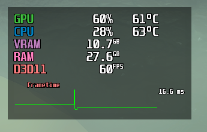

## Overlays for Rivatuner Statistics Server

### Usage

1. Place in `C:\Program Files (x86)\RivaTuner Statistics Server\Plugins\Client\Overlays`

2. Open RTSS and go to `Setup > Plugins > OverlayEditor.dll` to load the file.

### Optional Hotkeys

Place `HotkeyHandler.cfg` in `C:\Program Files (x86)\RivaTuner Statistics Server\Plugins\Client\`

`SHIFT`+`F1` Toggles framerate limiter  
`SHIFT`+`F2` Toggles overlay  
`CTRL`+`SHIFT`+`=` Increase limiter by 30  
`CTRL`+`SHIFT`=`-` Decrease limiter by 30  
`CTRL`+`SHIFT` + `1`, `2`, `3` etc. switches overlay styles

## Previews

#### Subtle

#### Mango

#### Mango with present mode and latency

#### Topbar

